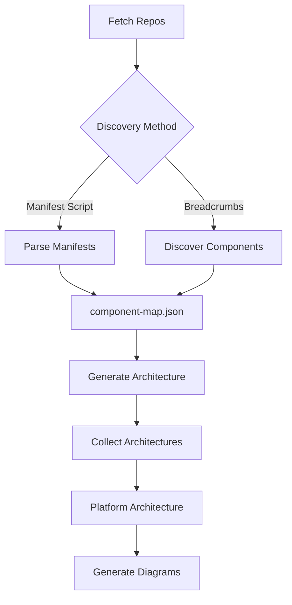

# Platform Architecture Context Pipeline

> **Automated platform architecture documentation powered by Claude AI**

Analyze complex software platforms and generate comprehensive architecture documentation automatically. Discover components, map dependencies, and produce detailed technical summaries with diagrams—all through AI-driven agents.

---

## 🎯 What This Does

Transform a collection of Git repositories into structured, comprehensive architecture documentation:

```
200+ repos in ./checkouts/                 →    Well-organized architecture docs
  ├── operators/                                ├── component-map.json
  ├── services/                                 ├── Component summaries (.md)
  ├── libraries/                                ├── Platform overview (PLATFORM.md)
  └── tools/                                    └── Architecture diagrams (.mmd, .dsl, .png)
```

**Input:** A directory of Git repositories (any source: GitHub, GitLab, local, etc.)  
**Output:** Structured markdown documentation, dependency graphs, and architecture diagrams

Perfect for:
- 📋 Architecture reviews and audits
- 🔒 Security Architecture Reviews (SAR)
- 📚 Technical documentation
- 🧭 Onboarding new team members
- 🔍 Understanding complex platforms

---

## ✨ Key Features

### 🔍 **Intelligent Component Discovery**
Two discovery methods for maximum flexibility:
- **Manifest-Based**: Parse existing manifest scripts (ODH, RHOAI)
- **Breadcrumb-Based**: Explore operators, dependencies, installers to discover components organically (Ansible, AAP)

### 🤖 **AI-Powered Analysis**
Claude AI agents analyze each component:
- Code structure and architecture patterns
- Dependencies and integrations
- APIs and contracts
- Security considerations
- Deployment configurations

### 📊 **Automatic Diagram Generation**
Creates multiple diagram formats:
- **Mermaid** diagrams (component, sequence, deployment)
- **C4 diagrams** (context, container, component)
- **Security diagrams** (network topology, data flows)
- **PNG renders** for easy sharing

### ⚙️ **Production-Ready Pipeline**
- **Concurrent processing**: Run multiple agents in parallel
- **Resumable**: Automatically skip already-analyzed components
- **Editable maps**: Manual review and adjustment of component lists
- **Multi-platform**: ODH, RHOAI, Ansible/AAP, or custom platforms

---

## 🚀 Quick Start

### Prerequisites

```bash
# Required
python 3.9+
anthropic API key

# Optional
gh (GitHub CLI)          # Only needed for Phase 1 (fetch)
mmdc (mermaid-cli)      # For rendering diagrams to PNG
```

### Installation

```bash
# 1. Clone the repository
git clone <repo-url>
cd platform-architecture-context-pipeline

# 2. Install dependencies
pip install -r requirements.txt  # or use uv
# OR: uv sync

# 3. Set up authentication
echo "ANTHROPIC_API_KEY=sk-ant-..." > .env

# 4. (Optional) Configure gh CLI if using fetch phase
gh auth login
```

### Run Your First Analysis

**For OpenDataHub/RHOAI (manifest-based platforms):**

```bash
# Run complete pipeline for RHOAI 2.25
python main.py all --platform=rhoai --branch=rhoai-2.25
```

**For Ansible/AAP (breadcrumb-discovery platforms):**

```bash
# Step 1: Clone repos (if needed)
# gh-org-clone ansible --dest checkouts/ansible

# Step 2: Discover components
python main.py discover-components \
  --platform=aap \
  --checkouts-dir=./checkouts/ansible \
  --entry-repo=awx-operator

# Step 3: Generate architectures
python main.py generate-architecture --platform=aap --max-concurrent=5

# Step 4: Collect and organize
python main.py collect-architectures --platform=aap

# Step 5: Create platform summary
python main.py generate-platform-architecture --platform=aap

# Step 6: Generate diagrams
python main.py generate-diagrams --platform=aap
```

**Output:**
```
architecture/aap/
├── component-map.json          # Component definitions
├── awx-operator.md             # Component architectures
├── eda-operator.md
├── automation-hub-operator.md
├── PLATFORM.md                 # Platform-level summary
└── diagrams/
    ├── awx-operator-component.mmd
    ├── awx-operator-c4.dsl
    ├── awx-operator-security.txt
    └── *.png
```

---

## 📁 Organizing Your Checkouts

**Phase 1 (fetch) is optional!** You don't need to use the built-in `fetch` command if you already have repositories cloned or scattered across different locations.

### Manual Checkout Organization

Simply organize your repos into a directory structure and point the pipeline at it:

```bash
# Create a checkout directory for your platform
mkdir -p checkouts/myplatform

# Clone or symlink repos however you like
cd checkouts/myplatform

# Option 1: Clone directly
git clone https://github.com/org/repo1
git clone https://github.com/org/repo2

# Option 2: Symlink existing checkouts
ln -s ~/projects/repo1 ./repo1
ln -s ~/workspace/repo2 ./repo2

# Option 3: Mix from multiple organizations
git clone https://github.com/org1/component-a
git clone https://github.com/org2/component-b
git clone https://gitlab.com/org3/component-c

# Option 4: Copy from elsewhere
cp -r /mnt/archive/old-repo ./old-repo
```

**Expected structure:**
```
checkouts/myplatform/
├── component-a/           # Any repo structure
├── component-b/
├── component-c/
└── operator/
```

### Using Manual Checkouts

Once organized, just point the pipeline at your directory:

```bash
# Discover components (reads from your directory)
python main.py discover-components \
  --platform=myplatform \
  --checkouts-dir=./checkouts/myplatform

# Or if you have a manifest script in one of the repos
python main.py parse-manifests \
  --platform=myplatform \
  --script-path=./checkouts/myplatform/operator/get_all_manifests.sh \
  --write-map

# Then proceed with analysis
python main.py generate-architecture --platform=myplatform
```

### When to Skip Fetch Phase

Use manual organization when:
- ✅ Repos are in multiple GitHub orgs
- ✅ Some repos are in GitLab, Bitbucket, etc.
- ✅ You already have local checkouts
- ✅ You need specific branches for different components
- ✅ Some repos are private/archived and need special handling
- ✅ Working with a subset of repos from a large org

The `fetch` phase is just a convenience wrapper around `gh-org-clone`. If that doesn't fit your workflow, skip it!

---

## 📖 Usage

### Phase-by-Phase Execution

The pipeline is organized into 6 phases that can be run independently:

#### **Phase 1: Fetch Repositories** _(Optional)_
```bash
python main.py fetch <org> --branch=<branch>
```
Clone all repositories from a GitHub organization.

**Note:** This is optional! You can organize checkouts manually if repos are scattered across orgs or already cloned locally. See [Organizing Your Checkouts](#-organizing-your-checkouts) above.

#### **Phase 2a: Parse Manifests** (for platforms with manifest scripts)
```bash
python main.py parse-manifests \
  --platform=rhoai \
  --branch=rhoai-2.25 \
  --write-map
```
Parse `get_all_manifests.sh` and create component map.

#### **Phase 2b: Discover Components** (for platforms without manifest scripts)
```bash
python main.py discover-components \
  --platform=aap \
  --checkouts-dir=./checkouts/ansible \
  --entry-repo=awx-operator
```
Intelligently discover components via breadcrumb exploration.

#### **Phase 3: Generate Component Architectures**
```bash
python main.py generate-architecture \
  --platform=aap \
  --max-concurrent=10 \
  --model=opus
```
Analyze each component and generate `GENERATED_ARCHITECTURE.md`.

**Filtering:**
```bash
# Single component
--component=awx-operator

# Pattern matching
--component="awx-*"

# Multiple components
--component=awx-operator --component=eda-operator
```

#### **Phase 4: Collect Architectures**
```bash
python main.py collect-architectures --platform=aap
```
Organize component docs into `architecture/<platform>/` structure.

#### **Phase 5: Generate Platform Architecture**
```bash
python main.py generate-platform-architecture \
  --platform=aap \
  --entry-component=awx-operator
```
Create high-level platform summary (`PLATFORM.md`).

#### **Phase 6: Generate Diagrams**
```bash
python main.py generate-diagrams \
  --platform=aap \
  --force-regenerate
```
Generate Mermaid, C4, and security diagrams.

### Model Selection

Choose the right Claude model for your task:

```bash
--model=opus    # Most capable (default), best for complex analysis
--model=sonnet  # Balanced performance/speed, good for discovery
--model=haiku   # Fastest, for simple/repetitive tasks
```

### Concurrency Control

```bash
--max-concurrent=10   # Run up to 10 agents in parallel (default: 5)
--limit=5             # Process only first 5 components (for testing)
```

---

## 🏗️ Architecture

### Pipeline Flow



### Component Discovery

**Breadcrumb Exploration** finds components by:
1. **Entry Points**: Operators, installers, platform repos
2. **Container Images**: References in manifests and configs
3. **Dependencies**: Python, Go, JavaScript dependency files
4. **Git Submodules**: Linked repositories
5. **CI/CD Pipelines**: Build and deployment references

**Output**: `architecture/<platform>/component-map.json`

### Agent Execution Patterns

Two approaches for running AI agents:

#### **1. Direct Skill Invocation**
Claude discovers and invokes skills automatically:
```python
run_agent(job, log_dir, model, enable_skills=True)
```
✅ Simpler, self-contained skills  
✅ Easier to test independently

#### **2. Templated Prompts**
Extract instructions and inject runtime context:
```python
instructions = extract_from_skill("skill-name")
prompt = f"{runtime_context}\n{instructions}"
run_agent(job, log_dir, model)
```
✅ Full control over prompts  
✅ Complex context injection (git metadata, build info)

See: [docs/skill-invocation-patterns.md](docs/skill-invocation-patterns.md)

### Skills

Located in `.claude/skills/`, each skill is a specialized AI agent:

| Skill | Purpose | Pattern |
|-------|---------|---------|
| `discover-components` | Find platform components via breadcrumbs | Direct invocation |
| `repo-to-architecture-summary` | Analyze single component | Templated (git/build context) |
| `collect-component-architectures` | Organize generated docs | Direct invocation |
| `aggregate-platform-architecture` | Create platform summary | Templated (build info) |
| `generate-architecture-diagrams` | Generate diagrams | Templated (format specs) |

---

## 📂 Project Structure

```
.
├── main.py                          # CLI entry point
├── lib/
│   ├── phases.py                   # Phase orchestrators
│   ├── agent_runner.py             # Agent execution (direct/templated)
│   ├── manifest_parser.py          # Manifest script parsing
│   ├── component_discovery.py      # Component map I/O
│   ├── build_info.py               # RHOAI build metadata extraction
│   └── kustomize_context.py        # Kustomize overlay context
├── .claude/skills/
│   ├── discover-components/        # Breadcrumb-based discovery
│   ├── repo-to-architecture-summary/
│   ├── collect-component-architectures/
│   ├── aggregate-platform-architecture/
│   └── generate-architecture-diagrams/
├── scripts/
│   ├── collect_architectures.py
│   ├── get_git_changes.py
│   └── generate_diagram_pngs.py
├── architecture/                   # Output directory
│   └── <platform>/
│       ├── component-map.json
│       ├── *.md
│       └── diagrams/
├── logs/                           # Agent execution logs
└── docs/
    ├── README.md                   # Comprehensive guide
    ├── component-discovery.md      # Discovery methods
    └── skill-invocation-patterns.md
```

---

## 📚 Documentation

- **[docs/README.md](docs/README.md)** - Complete pipeline guide
- **[docs/component-discovery.md](docs/component-discovery.md)** - Discovery methods explained
- **[docs/skill-invocation-patterns.md](docs/skill-invocation-patterns.md)** - Agent execution patterns

### Generated Documentation Format

Each component receives a structured markdown document:

**GENERATED_ARCHITECTURE.md** contains:
- **Metadata**: Repository, distribution, version
- **Overview**: Purpose and role in platform
- **Architecture**: Key components and patterns
- **APIs & Contracts**: Exposed interfaces
- **Dependencies**: External and internal deps
- **Deployment**: Kubernetes manifests, configs
- **Security**: Authentication, authorization, data flow
- **Recent Changes**: Git history analysis

**PLATFORM.md** aggregates:
- Platform-wide architecture overview
- Component relationships and dependencies
- Deployment topology
- Security architecture
- Technology stack summary

---

## 🎨 Customization

### Adding a New Platform

```bash
# 1. Discover components
python main.py discover-components \
  --platform=myplatform \
  --checkouts-dir=./checkouts/myorg

# 2. Review/edit component-map.json
vim architecture/myplatform/component-map.json

# 3. Generate docs
python main.py generate-architecture --platform=myplatform
python main.py collect-architectures --platform=myplatform
python main.py generate-platform-architecture --platform=myplatform
python main.py generate-diagrams --platform=myplatform
```

### Creating Custom Skills

Add new skills in `.claude/skills/my-skill/`:

```markdown
---
name: my-skill
description: What this skill does (used for Claude discovery)
allowed-tools: Read, Write, Bash, Grep
---

# My Skill

## Instructions

Step-by-step instructions for the AI agent...
```

Skills are automatically discovered when placed in `.claude/skills/`.

### Manual Component Map Editing

Edit `architecture/<platform>/component-map.json` to:
- Add missing components
- Remove false positives
- Adjust refs or source folders
- Override discovery metadata

Re-run phases after editing—changes are preserved.

---

## 🔧 Troubleshooting

### Skills Not Loading
```bash
# Ensure .claude/skills/ exists in project root
ls .claude/skills/*/SKILL.md

# Check working directory in agent options
# cwd must point to directory containing .claude/
```

### Component Not Found
```bash
# Check component map
cat architecture/<platform>/component-map.json | jq '.components | keys'

# Verify checkout exists
ls checkouts/<org>/<repo>
```

### Agent Failures
```bash
# Check logs
cat logs/generate-architecture/<component>.log

# Re-run single component with --force
python main.py generate-architecture \
  --platform=aap \
  --component=awx-operator \
  --force
```

### Rate Limits
```bash
# Reduce concurrency
--max-concurrent=2

# Use faster model for discovery
--model=sonnet
```

---

## 🤝 Contributing

Contributions welcome! This is an experimental pipeline for architecture documentation.

### Areas for Improvement
- Additional platform support (Kubernetes operators, Helm charts, etc.)
- Enhanced breadcrumb detection (more dependency types)
- Diagram format customization
- Performance optimizations
- Additional skill templates

---

## 📄 License

[Add your license here]

---

## 🙏 Credits

Built with:
- **[Claude AI](https://anthropic.com/claude)** - AI-powered analysis and documentation
- **[Claude Agent SDK](https://github.com/anthropics/claude-agent-sdk)** - Agent orchestration framework
- **[GitHub CLI](https://cli.github.com/)** - Repository management
- **[Mermaid](https://mermaid.js.org/)** - Diagram generation
- **[Structurizr](https://structurizr.com/)** - C4 diagram format

---

## 💡 Example Output

### Component Architecture Summary
```markdown
# AWX Operator

**Repository**: ansible/awx-operator  
**Distribution**: AAP 2.5.0  
**Type**: Kubernetes Operator

## Overview
Kubernetes operator for deploying and managing AWX instances...

## Architecture
- Operator Pattern (controller-runtime)
- Custom Resource Definitions (CRDs)
- Reconciliation loops for AWX lifecycle

## APIs
- CRD: `awx.ansible.com/v1beta1/AWX`
- Exposed Services: awx-operator-controller-manager

## Dependencies
- operator-sdk
- controller-runtime
- AWX (deployed application)

[... detailed sections ...]
```

### Platform Summary
```markdown
# Ansible Automation Platform 2.5.0

## Platform Overview
Platform consisting of 12 core components for automation orchestration...

## Component Relationships
- awx-operator → AWX (manages)
- eda-operator → EDA Server (manages)
- automation-hub-operator → Hub (manages)

## Technology Stack
- Go operators (operator-sdk, controller-runtime)
- Python services (Django, asyncio)
- PostgreSQL databases
- Redis caching

[... comprehensive platform analysis ...]
```

---

**Ready to document your platform?** Start with:
```bash
python main.py discover-components --platform=myplatform --checkouts-dir=./checkouts
```

